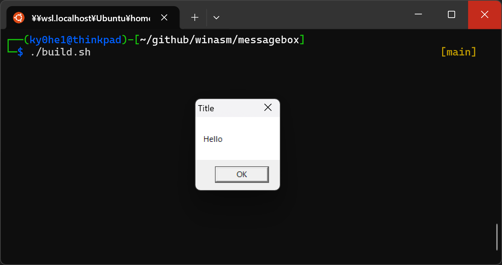
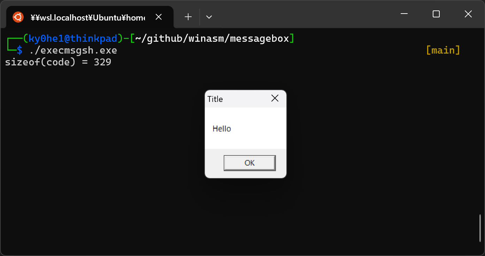

# WinAsm

## 説明

Windows(64bit)における、シェルコードの勉強。

(シェルコードと言いつつ、シェルは起動していない。)

### messagebox

#### 流れ

1. kernel32.dll のアドレス取得
2. kernel32.dll のエクスポートテーブルから LoadLibraryA と GetProcAddress のアドレス取得
3. LoadLibraryA で user32.dll を読み込む
4. GetProcAddress で user32.dll から MessageBoxA のアドレス取得
5. MessageBoxA を実行

### 実行方法

WSL上を前提としている。

```.sh
cd messagebox
./build.sh
```



シェルコードを作成して、それを呼び出すコードをコンパイル。

```.sh
objdump -M intel -d messagebox.exe | grep '^ ' | cut -f2 | perl -pe 's/(\w{2})\s+/\\x\1/g'
x86_64-w64-mingw32-gcc execmsgsh.c -o execmsgsh.exe
./execmsgsh.exe
```


